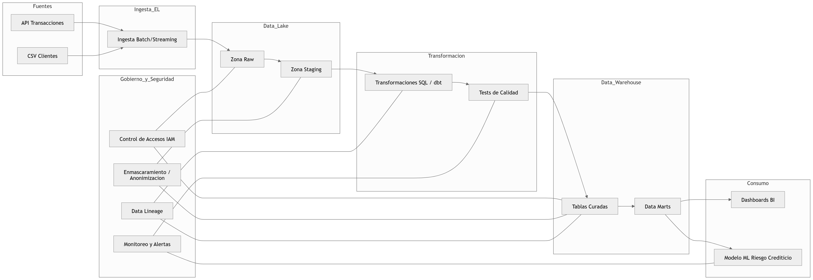
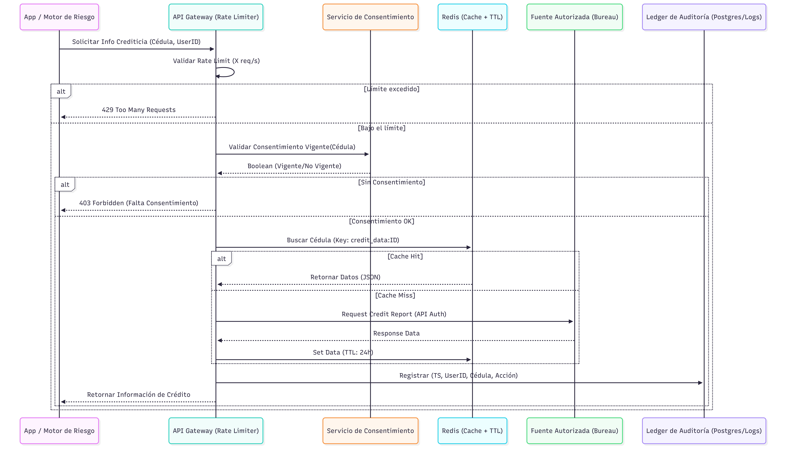
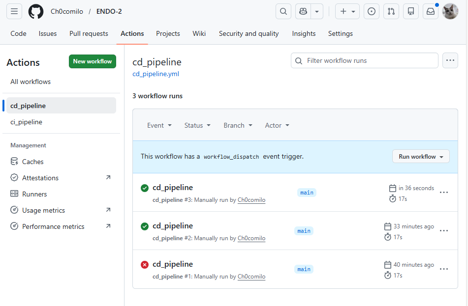
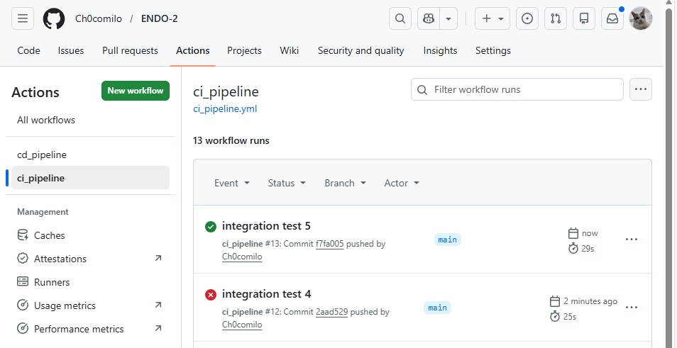
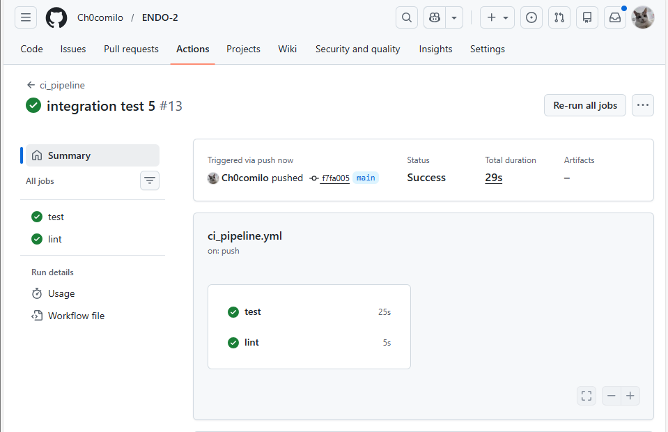

# Parcial práctico

Contexto del incidente: Un analista de crédito descargó un archivo CSV con datos personales no anonimizados de 50,000 clientes (nombres, cédulas, ingresos, historial de pagos) a su computadora personal para hacer un análisis ad-hoc. La computadora tenía malware y los datos fueron filtrados. Además, el modelo de riesgo crediticio comenzó a rechazar sistemáticamente a clientes de una región específica por un error silencioso en una transformación de datos que nadie detectó durante 3 meses.

1. Análisis de Incidente y Fallas de Gobierno de Datos (15%)

El problema más importante es porque un analista pudo descargar datos personales sin anonimizar a su equipo local, claramente esta violando el principio de seguridad y control de acceso, que tambien lo llaman el principio de mínimo privilegio y zero trust (spanglish)

Otro problema es que los datos no estaban anonimizados ya que conteían PIIs  y su principio violado es el de privacidad desde el diseño, ya que no se aplicaron técnicas cómo hashing, tokenización etc..

Otro problema es la falta de monitoreo y auditoría en el uso de los datos ya que no se detecto ninguna extracción masiva ni un uso fuera del entorno controlado (los tenía en su computadora personal) entonces se violó el principio de observavilidad y monitoreo continuo

Tambien brillaron por su ausencia las validaciones en los pipelines de los datos porque pasaron 3 meses cometiendo errores que le cuestan mucha plata a la empresa, violando claramente el testing continuo y el monitoreo de la calidad de los datos

Por ultimo el modelo usado para el puntaje credicticio sufría de sesgos ya que discriminaba a una región en particular sin ningún tipo de alertas entonces no hubo un feedback continuo ni monitoreo de modelos lo que sería el principio de observabilidad del modelo (algo que también estamos viendo en ESPD)

- Explique cómo la falta de un modelo de gobierno de datos contribuyó a que el incidente pasara desapercibido durante meses.

El hecho de que no hubieran unos roles con responsabilidades claras fue una de las causas principales del problema ya que nadie era responsable de la calidad ni de la seguridad ni del monitoreo de los datos y les dejaban ese trabajo a personas especializadas en hacer otros. Tampoco había la existencia depolíticas sobre los datos como el acceso a datos sensibles, uso de entornos seguros entre otros al igual que la falta de trazabilidad o el linaje de los datos ya que no se podían rastrear ya que nadie pudo detectar la transformación que afecto al modelo. Hubo tambien falta de controles automatizados porque si el analista tuvo que descargar los datos entonces no hay automatización en el sistema, volviendolo mas vulnerable y entorpeciendo los workflows.

- Proponga 3 métricas clave (KPIs) que la empresa debería monitorear para prevenir incidentes similares en el futuro. Cada KPI debe tener: fórmula, umbral de alerta y frecuencia de medición.

KPI1: la tasa de acceso a datos sensibles no autorizados, donde por mucho por mucho el umbral debe estar aprox 0.1% porque tampoco se va a formar un escandalo por algún dato público que se compartió en un chat de whatsapp sin querer y debe ser a tiempo real porque si se deja pasar entonces el delincuente estaría teniendo acceso a estos datos por mucho tiempo

la formula sería algo como

 numero de accesos no autorizados detectados / accesos totales a datos sensibles

KPI2: es la calidad de los datos
Y con calidad me refiero al porcentaje de datos que fueron exitosos sobre todos los datos procesados con un umbral de alerta del 98%, si baja de ahí preocúpese y esta revisión debe hacerse cada vez que se ejecute un pipeline

y la formula tambien es fácl de deducir:

numero de checks de calidad exitosos / numero de  checks ejecutados

KPI3: Sesgo del modelo

Ahora queremos que el modelo no discrimine por regiones entonces por eso tendremos un puntaje de sesgo donde no puede tener mas de 10% de desviación frente a los demás regiones, y debe realizarce por hay cada semana  ya que eso es mejor que 3 meses y su formula es básicamente mirar cuanto se desvía de la media o puntaje global

|tasa_aprobacion_region - tasa_aprobacion_global|

2. Arquitectura y Estrategia DataOps (15%)

Dibuje un diagrama del data pipeline que siga el paradigma ELT. Incluyendo: fuentes (API de transacciones, CSV de clientes), Data Lake, proceso de transformación, Data Warehouse, y capa de reportes/ML.



(Diagrama hecho con IA)
Se puede ver que primero entran los datos crudos para que enseguida se den control deacceso y anonimización, linaje y monitoreo desde el primer momento, entonces ahora si se puede transformar porque ya pasamos la etapa EL y pasamos a T y con los respectivos test de calidad, luego cuando ya pasaron esos test, entran al data warehouse y de aquí ya pasan al consumo, debemos fijarnos también que staging esta con los datos en la fase EL como bien se indica en el taller con el monitoreo en cada instante

Justifique por qué eligió ELT sobre ETL para esta startup. Mencione al menos 2 ventajas específicas para el caso de microcréditos.

Un sistema de microcrédos necesita velocidad, flexibilidad y sobre todo y lo mencionaba varias veces en el punto anterior auditabilidad entonces ELT es justo lo que necesitamos para esto ya que en micrócreditos los modelos tienen que estar cambiando constantemente ya sea con nuevas variables, features, reglas etc... entonces los datos crudos se almacenan en un delta lake y no tenemos que rediseñar un pipeline cada vez que se vaya a cambiar algo, también tenemos trazabilidad completa, entonces necesitamos explicar desiciones y como el ELT me permite conservar datos en estado original entonces que mejor que el ETL, y finalmente tenemos la detección de errores y sesgos ya que si se hubiera usado ELT se hubiera podido detectar antes con mayor facilidad ya que puedo comparar los datos crudos contra los transformados y ver como cambian las distribuciones por región

Explique cómo implementaría múltiples entornos adaptados a un equipo de 5 personas con recursos limitados en la nube. ¿Qué datos usaría en cada entorno? ¿Cómo evitaría el "pantano de datos"? ¿Cómo garantizaría que los cambios que pasan en Staging no rompan Producción?

Aquí ya se toman en cuenta las consideraciones anteriores sobre todo la de asignación de privilegios y buena definición de los roles, así que iría un desarrollador que me realice todo el software y cuente con datos dummies o muy anonimizados ya que el no necesita datos reales y en caso de datos reales un dataset muy pequeño así el desarrollo es rápido, también habría una persona encargada de la pre producción que es el que se encarga de validar que todo esté bien antes de llegar a producción y trabajaría con datos casi reales, quizas un mixto para testear los pipelines y los modelos, luego estaría producción que ellos son los encargados de las operaciones reales y necesitan los datos completos pero eso sí, con los PII protegidos.

Para evitar el pantano de datos se debería implementar un data catalog obligatorio documentando cada tabla etc con nombres de variables super descriptivos y borrar bases de datos antiguas para no tener información de más y ocupar menos memoria entonces se debe tener el ciclo de vida del dato bien claro, además chekeos automáticos en los pipelines de calidad de los datos y cada dataset debe tener un dueño que sea responsable de este mismo.

Ahora dbemos garantizar que Staging o pre producción no rompan a producción porque sino cual sería la gracia, están ahí para ayudar más no para entorpecer, así que por eso se inventaron los CI/CD para hacer test automáticos antes de hacer merge, además tambien por medio del versionamiento de los datos y pipelines para poder hacer rollbacks, o transformaciones que me modifiquen los datos

3. Ética, Regulaciones y Cultura de Datos (10%)

El modelo de riesgo crediticio discriminaba por región. Basado en los principios éticos, proponga un procedimiento de 4 pasos que todo equipo debe seguir antes de poner un modelo en producción para evitar sesgos.

primero debe haber una auditoría de datos de entrada, como analizar la distribución por variables sensibles como la región, el género o la clase social y detectar algun desbalance y hacer un reporte, luego hacer una evaluación de que tan justo es el modelo, lo que llaman fairness, que esta definido cómo uno de los KPIs propuestos, luego una mitigación de sesgos ya sea con un rebalanceo de datos y/o eliminación de variables sensibles, y por último monitoreo continuo en producción ya sea con un dashboard y alertas automáticas.

¿Cómo aplicaría el principio de "datos como producto" para que los equipos de negocio, IT y ciencia de datos compartan responsabilidad sobre la calidad y seguridad? Describa al menos 2 artefactos o contratos formales.

por medio de los data contracts, que son acuerdos entre los productores (IT) y consumidores (negocio) ya que estos tiene políticas bien definidad y evitan errores silenciosos como los que pasaron en el incidente, también estan la especificación de los productos de datos, donde se incluye quien es el responsable, la descripción del negocio, algunos casos de uso, el linaje entre muchos otros pero se puede ver claramente que alinea el negocio con los productores y la ciencia de datos

Si se quisiera enriquecer las solicitudes de crédito con el puntaje crediticio de los solicitantes, a través de hacer web scraping a datacredito para obtener esta información "gratis", basado en el Habeas Data en Colombia, explique 3 razones por las que este scraping sería ilegal y violaría principios de protección de datos personales. Proponga 3 alternativas legales y éticas para obtener información crediticia. Para cada una, indique: viabilidad (alta/media/baja), costo estimado, y nivel de confianza de los datos. Si hipotéticamente estuviera explícitamente autorizado por escrito, escriba en pseudocódigo una función scrape_credit_score(cedula) que incluya:
•
Verificación de caché local
•
Rate limiting (respetar servidor)
•
User-agent identificable
•
Registro de auditoría en logs
•
Manejo de errores (404, timeout, cambio de estructura)

la principal razón es porque va en contra de la ley de habeas data o 1581, además es la violación del consentimiento informado ya que el titular no autorizó que sus datos se extraigan por medio de scraping, también es un uso indebido de datos personales porque solo pueden usarse para propósito autorizado, aunque estas son solo instancias de la ley 1581 pero tengo que poner 3 porque así lo dice el ejercicio

como 3 alternativas está el uso ofical de alguna API (si la tienen claro) y tienen tanto viabilidad como confianza muy alta a cambio de un precio alto, luego esta tener algunas alianzas con algunos bancos donde la viabilidad de los datos recaería en ellos pero serían de alta confianza y no a costos muy altos, y por último esta la simulación con datos abiertos que tienen viabilidad muy alta porque están diseñados para eso pero cómo no provienen de entornos reales no son muy confiables aunque tambipen son más baratos

```python
def scrape_credit_score(cedula):

    # ========================
    # 1. CACHE LOCAL
    # ========================
    if cache.exists(cedula):
        return cache.get(cedula)

    # ========================
    # 2. RATE LIMITING
    # ========================
    wait_if_needed(max_requests_per_minute=10)

    try:
        # ========================
        # 3. REQUEST CON USER-AGENT
        # ========================
        response = http.get(
            url="https://datacredito.com/score",
            params={"cedula": cedula},
            headers={
                "User-Agent": "FastFinTech-Bot/1.0 (contacto@empresa.com)"
            },
            timeout=5
        )

        # ========================
        # 4. MANEJO DE ERRORES
        # ========================
        if response.status_code == 404:
            log.warn("Usuario no encontrado", cedula)
            return None

        if response.timeout:
            log.error("Timeout", cedula)
            retry()

        # Parse HTML (estructura puede cambiar)
        score = parse_html(response.content)

        if score is None:
            raise Exception("Cambio en estructura HTML")

        # ========================
        # 5. AUDITORÍA
        # ========================
        log.info("Consulta exitosa", {
            "cedula": cedula,
            "timestamp": now()
        })

        # Guardar en cache
        cache.set(cedula, score, ttl=86400)

        return score

    except Exception as e:
        log.error("Error scraping", {
            "cedula": cedula,
            "error": str(e)
        })
        return None
```

(código hecho con chatgpt)

Si su jefe le insiste en hacer scraping sin autorización para "ahorrar costos", ¿qué haría?

Si fuera un ciudadano de bien y mi vida no dependiera de mi trabajo (osea nadie) le explicaría los riesgos legales y reputacionales que implica esto, lo ofrecería las alternativas antes vistas y si definitivamente no logro convencerlo simplemente me niego a hacerlo porque es mi responsabilidad como profesional con principios éticos (lástima que el dueño lo despide a uno, contrata a alguien que si lo haga)

1. Arquitectura hipotética: Dibuje un diagrama de secuencia de cómo sería un sistema
   autorizado para extraer datos crediticios respetando:
   • Rate limiting (X requests/segundo)
   • Cache con TTL
   • Auditoría de cada consulta
   • Mecanismo de consentimiento del titular

-

(diagrama hecho con gemini)

2. Pseudocódigo (no ejecutable) de una función que:
   • Verifique si la cédula tiene consentimiento vigente
   • Consulte caché primero (Redis simulado)
   • Si no está en caché, realice la petición a la fuente autorizada
   • Registre en audit_log con timestamp, usuario que solicitó, cédula consultada

```python
def obtener_informacion_crediticia(cedula, usuario_solicitante):
    # 1. Verificar consentimiento en DB de cumplimiento
    consentimiento = db_consentimiento.verificar_estado(cedula)
  
    if not consentimiento.es_valido():
        registrar_auditoria(usuario_solicitante, cedula, "ACCESO_DENEGADO_SIN_CONSENTIMIENTO")
        raise SecurityException("El titular no tiene un consentimiento vigente.")

    # 2. Intento de recuperación desde Caché (Redis)
    cache_key = f"credit_ref:{cedula}"
    datos_crediticios = redis_client.get(cache_key)

    if datos_crediticios:
        fuente = "CACHE"
    else:
        # 3. Consulta a fuente externa si no hay caché
        try:
            datos_crediticios = fuente_autorizada_api.fetch(cedula)
            # Guardar en caché con Time-To-Live (TTL) de 24 horas
            redis_client.set(cache_key, datos_crediticios, ex=86400)
            fuente = "API_EXTERNA"
        except APIError as e:
            registrar_auditoria(usuario_solicitante, cedula, f"ERROR_PROVEEDOR: {str(e)}")
            raise

    # 4. Registro mandatorio en Log de Auditoría
    # Incluye timestamp generado automáticamente por el sistema de logs
    audit_log.record(
        timestamp=datetime.now(timezone.utc),
        usuario=usuario_solicitante,
        target_cedula=cedula,
        origen_dato=fuente,
        evento="CONSULTA_CREDITICIA_EXITOSA"
    )

    return datos_crediticios
```

(código hecho con gemini)

Plan de monitoreo: Proponga 3 métricas para monitorear la salud del sistema de
extracción crediticia (tiempo respuesta, tasa de éxito, latencia de caché).

El tiempo de respuesta del pipeline debe ser menor a 500 ms porque de otra forma muy probablemente ha entrado en algún cuello de botella, luego esta la latencia del caché donde voy a tomar en cuenta el porcentaje de consultas resueltas por encima del 70% contra las consultas a la fuente externa, y por último tenemos la tasa de exito, donde vamos a mirar son la tasa de fallos que debe ser menor al 1% por falta de consentimiento o fallo del proveedor

# Enfoques data ops usados en el parcial

En data_validation.py mediante la funcion enforce_quality me aseguro de que los datos cumplan los esquemas de ingresos y montos evitando así que entren datos corruptos al modelo

tambien trato a los datos como producto porque en el orchestrator.py genero un log de auditoría (en JSON) que registra un timestamp, nivel de error y contexto de cada paso evitando la falla del incidente donde no detectaron cambios durante esos 3 meses, tambien se implemento un mecanismo de checkpoints donde si el proceso falla el orquestador sabe exactamente donde quedo y puede retomar sin hacer todo desde cero

Y finalmente se implemento un backoff exponencial que maneja errores que pueden ocurrir en la red o el sistema de forma automática sin intervención humana

## Escalabilidad

Si el negocio crece y pasamos a 100 gb diarios, el enfoque actual con pandas y archivos JSON locales colapsaría, entonces se debería hacer un plan de migración con procesamiento distribuido como apache spark que manejan esto mucho mejor, tambien se dejaría de trabajar con csv para trabajar con archivos en formato parquet ya que reduce bastante el peso y permite leerlos en particiones de forma más sencilla, tambien o se orquestaría con un simple código en python sino por medio de DAGs con airflow (como estamos haciendo en el proyecto) y para el streaming usaríamos kafka para que la validación ocurra en milisegundos antes de que siquiera toque el delta lake


# Ejecución del pipeline

preparamos el entorno, obviamente primero debes crear uno, entonces ahí

```bash
pip install -r requirements.txt
```

luego ejecutamos el pipeline

```bash
python -m src.orchestrator
```

y luego las pruebas (CI/CD)

```bash
pytest tests/test_enrichment.py
pytest tests/test_validation.py
```


### pruebas CI/CD






